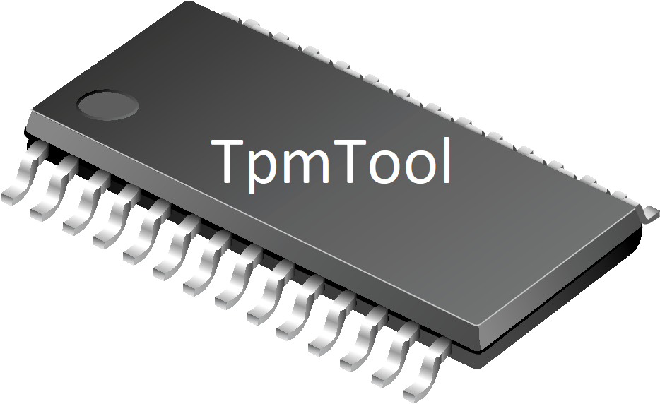

# TPM NV Space Access Tool (`tpmtool`)
[](tpmtool-logo.png)
The `TpmTool` utility is a cross-platform tool for accessing `TPM2.0` Non-Volatile (NV) Spaces (Index Values) on compliant systems. It provides the ability to enumerate, create, delete, query, and lock NV indices, as well as to read and write data stored in them.

# Purpose
All modern systems that shipped with Windows `10` and later have either an on-board Trusted Platform Chip (TPM) from a vendor such as Infineon which supports the `TPM2.0` standard, or have modern Intel hardware with embedded Platform Trust Technology (PTT), which fully supports the `TPM2.0` standard without requiring an external chip.

While normally only used if the user enables BitLocker, or Active Directory Remote Attestation (or Host Guardian), or leverages Windows Defender System Guard, the `TPM2.0` fully allows for programmatic use by applications and users on the machine, providing capabilities such as random number generation (RNG), authentication, encryption and decryption, attestation and sealing of secrets, and more. 

Access to the TPM chip is typically be provided by a low-level driver (`Tpm.sys` on Windows, `\dev\tpm0` on Linux), but since the interface is inherently exclusive to a single calling process, most operating systems provide an abstraction on top of the raw interface. In Windows, this is called the TPM Base Service (`Tbs.sys`), and in Linux, the TPM Resource Arbitrator or Resource Manager (`\dev\tpmrm0`). Further, higher-level SDKs exist on top of these stacks, such as `TPM.MSR` from Microsoft, or TSS2 from IBM.

While these abstractions are useful and provide portable ease of use to professional enterprise-grade applications, they make leveraging `TPM2.0` functionality a painful combination of libraries, `.NET` code, version interdependencies, and make troubleshooting errors at the silicon level all but impossible. Developers end up learning how to use the SDK, not how the actual TPM works.

To solve this, `TpmTool` was created for a dual-purpose. First, as a pre-compiled Win32 binary, it allows average computer users to read and write secrets in their TPM chips, optionally protected by a custom password, without any dependencies. Think of it as their own little secret lock box.

Second, as it is fully open source and commented, it provides an easy-to-learn-from guide into how to correctly build and send `TPM2.0` commands, as well as parse their replies, without large competing 3rd party SDKs getting in the way, and without having to understand the full machine-generated 640KB specification headers. The code and headers behind `TpmTool` are meant to be easy to read, and leverage modern C++ functionality for clearer and stricter interpretation of the `TPM2.0` standard's structures -- all while keeping the same naming conventions for ease of reference.

# Features
* Enumerate all `TPM2.0` handles that map to NV index values.
* Query a particular NV index value to get back its size, attributes, permissions, and dirty (_written_) flag.
* Create a new NV index of up to the architecturally maximum supported size, with an optional password authorization. The following attributes are supported
  - Making the index support being locked against read and/or write access until the next reset.
  - Making the index support being write-once once locked, regardless of reset.
  - Making the index write-all such that all data must be written in one go, starting at offset `0`.
  - Making the index store its data in RAM, and only written to NV storage during orderly shutdown.
  - Making the index's dirty (_written_) flag volatile, i.e.: cleared at the next reset.
  - Making the index non-deleteable except through special policy. Note that `tpmtool` does not support this type of deletion, however.
  - Making the index unprotected against dictionary attacks and ignore the lockout if one was reached.
* Delete an existing NV index, as long as authorization is valid and the index does not require policy-based deletion (see above).
* Read the data stored in an NV index, both as a hex dump in `STDERR` for visual rendering, as well as raw data in `STDOUT`, which can be redirected to a file.
* Write data to be stored in an NV index, based on `STDIN`, which can either be piped through `echo` or redirected from a file.
* Lock an NV index either against further reads, and/or against further writes, until the next `TPM2.0` reset. The index must have been created with the appropriate attributes to allow read and/or write locking, and further, if it was created as write-once, then it can only be deleted and re-created. 

# Requirements
For Windows, you must have a valid `TPM2.0` chip and Windows `8` or later, which is the first version where support for `TPM2.0` was added to the TPM Base Services (TBS). For Linux, you must have a valid `TPM2.0` chip and a Linux Kernel which supports the TPM Arbiter Service (`TPMAS`) either natively or through a 3rd party daemon. Either way, it must be accessible through `/dev/tpmrm0`.

On Windows, you must run `TpmTool` with `Administrator` privileges and similarly, on Linux, with `root` privileges such as through usage of `sudo`.

# Examples

# Full Usage Help
```
TpmTool v1.0.0 - Access TPM2.0 NV Spaces
Copyright (C) 2020 Alex Ionescu
@aionescu -- www.windows-internals.com

TpmTool allows you to define non-volatile (NV) spaces (indices) and
read/write data within them. Password authentication can optionally
be used to protect their contents.

Usage: tpmtool [-e|index]
               [-c <attributes> <owner> <auth> <size>|-r <offset> <size>|-w <offset> <size>|-rl|-wl|-d|-q]
               [password]
    -e    Enumerates all NV spaces active on the TPM
    -c    Create a new NV space with the given index value.
          Attributes can be a combination (use + for multiple) of:
              RL    Allow the resulting NV index to be read-locked.
              WL    Allow the resulting NV index to be write-locked.
              WO    Make the write-locked state of the NV index permanent.
              WA    Partial writes are not allowed into the NV index.
              NP    No protection against dictionary attacks.
              CH    Cache the resulting NV index in RAM (orderly).
              VL    Makes the dirty flag volatile (cleared at startup).
              PT    Marks the NV space as non-deletable without a policy.
          Owner and Auth rights can be one of R, RW, or NA.
          Size is limited by TPM should usually be 2048 or less.
    -r    Read the data stored at the given index value.
          Offset and size must be fit within size of the space.
          Data is printed to STDOUT and can be redirected to a file.
    -w    Write the data from STDIN into the given index value.
          Offset and size must be fit within size of the space.
          You can use pipes or redirection to write from a file.
    -q    Query the size, rights, and attributes of the given index.
          Also indicates if the index has ever been written to (dirty).
          Attributes are the same as shown earlier, with the addition of:
              LR    The index is locked against reads until reset.
              LW    The index is locked against writes until reset.
                    NOTE: If the WO attribute is set, locked forever.
              PO    The index was created and is owned by the platform.
    -rl   Lock the NV space at the given index value against reads.
          The NV space must have been created with the RL attribute.
    -wl   Lock the NV space at the given index value against writes.
          The NV space must have been created with the WL attribute.
    -d    Delete the NV space at the given index value.

If the index was created with a password and owner auth is NA, the
password must be used on any further read or write operations.
